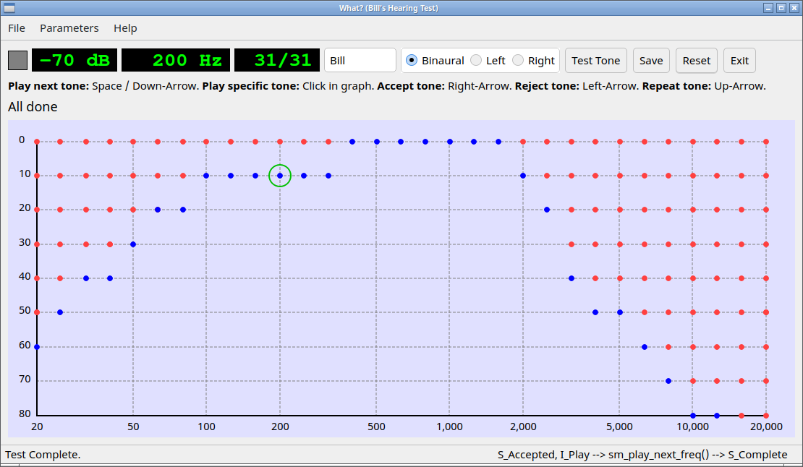
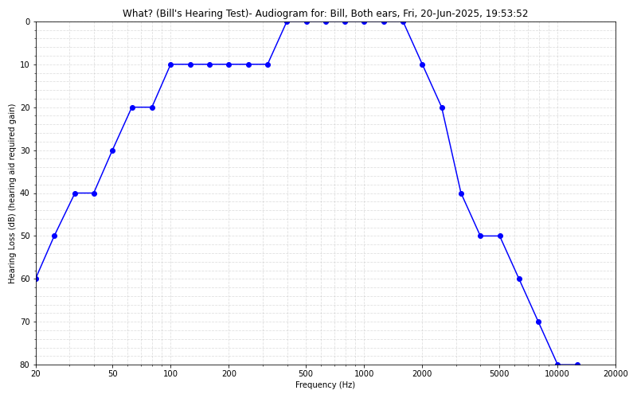

# What? - (Bill's Hearing Test)

*What? - (Bill\'s Hearing Test)* is a multi-platform, graphical, hearing
test program. It plays a series of tones at random frequencies and
increasing volume or as indicated by a click on the graph. Reject the
tone to go on to the next higher volume or accept the tone to go on to
the next frequency.

Test results are relative, not absolute, because the chain of audio from
your computer to your headphones to your ears is not calibrated. They
can be used to compare hearing between ears and monitor changes over
time but not to set absolute gain on a hearing device.

The gain (amplitude) of tones is shown in dB with 0 dB the maximum
volume.

The Y-axis of the graph is *hearing loss* in dB, that is, the gain
required for a hearing aid to bring a tone at the indicated frequency to
a normal level.

Screenshot of *What?* after completing a hearing test.

### Features

- Multi-platform: Windows, MacOS, Linux.
- Standalone desktop application.
- No data shared with others.
- Settable frequency range, default 250 -\> 16,000 Hz.
- Settable frequency points/octave, default 4; gain points/10dB, default 1.
- Hearing loss range: 0 -\> 80 dB.
- Audiogram saved in image file.

Audiogram saved from the above hearing test.

## Quick Start

- Go to a quiet room and put on a pair of headphones.
- Launch What?
- Press Space.
- Press Right-Arrow if you heard a tone, Left-Arrow if not.
- Repeat prior two steps until *All done* notice appears.
- Press *Save* to copy the audiogram to a file.

### Display

- **Indicator Square** Green while a tone is playing
- **Gain** The gain (or amplitude) of the current tone in dB.
- **Pitch** The frequency (or pitch) of the current tone in Hz.
- **Step** Shows the progress through the series test frequencies. The
  position in the series is not affected by clicking in the graph.

### Keyboard

- **Space / Down-Arrow** *Play* the next tone of the test sequence.
  Repeat the current tone on successive presses until the tone is
  accepted or rejected.
- **Up-Arrow** Repeat the current tone.
- **Left-Arrow** Reject the current tone. Increase the gain on the next
  *Play*, advance to the next frequency when maximum gain reached.
  Rejected tones are marked with a red dot.
- **Right-Arrow** Accept the current tone. Advance to the next frequency
  at the lowest gain on the next *Play*. Accepted tones are marked with
  a blue dot and are saved for the audiogram.
- **Backspace** Backup through the sequence of test tones or tones as
  placed with a click, whichever was the most recent. Removes the marker
  from the graph.

You can change your mind between accept or reject any time before
playing the next tone in the sequence and you can repeat a tone any time
before accept or reject. You can change your mind after playing the next
tone or tones in the sequence with Backspace. You can also backup
through the most recent series of tones placed with a mouse click with
Backspace.

### Mouse

- **Click** in the graph to *Play* a tone at the indicated frequency and
  gain. Accept or reject the tone or continue in the test sequence using
  the keyboard as above. Use this to make adjustments in test-tone gains
  near the threshold of hearing for finer gain resolution than default
  10 dB as used in the test-tone sequence.

  Mouse clicks snap (are quantized) to the nearest 2 dB gain and .2
  octave intervals, the same as the graph grid. With the default test
  parameters this is generally not the same as the points in the test
  sequence.

### Controls

- **Name** - Include *Name* in the title and filename of the audiogram.
- **Binaural, Left, Right** - Select the output channel for the test.
- **Test Tone** - Play a brief 1000 Hz tone at 0 dB.
- **Save** - Save the audiogram shown in the graph to an image file.
- **Reset** - Clear the graph and reset the test-tone sequence to the
  beginning.
- **Exit** - Exit What?

### Menus
- **File-\>Quit** Exit What?.

- **Parameters-\>Edit** Change the test parameters: start and end
  frequencies, number of frequency points per octave and number of gain
  points per 10 dB. The hearing loss range is 0 to 80 dB and is not
  settable. Changes to test parameters are saved between launches.

- **Parameters-\>Show** Show the test parameters, frequencies, and gains
  of the test points.

- **Parameters-\>Default** Set the test parameters: 125 -\> 16,000 Hz, 1
  gain point per 10 dB, and 4 frequency points/octave.

- **Help** - Self evident.

### The Test Sequence

Tones are presented to the user in two independent ways, from a list of
tones and gains, or as placed with a mouse click in the test graph. The
list of tones and gains is known as the *Test Sequence* and can be
viewed using *Parameters-\>Show*. The frequencies in the *Test Sequence*
are quantized to specific frequencies as determined by the number of
points per octave parameter. The order of presentation is randomized at
each launch of *What?* and at each *Reset*. The gains in the *Test
Sequence* are quantized to specific gains as determined by the number of
points per 10 dB parameter. They are presented in order of increasing
gain until accepted.

Tones from the *Test Sequence* and as placed by clicks are both reported
in the audiogram. They are independent except when backing up with
Backspace. *What?* has separate history lists for the sequence and
clicks and backs up through the most recent list, either the sequence
list or the click list.

© Bill Wetzel 2025

